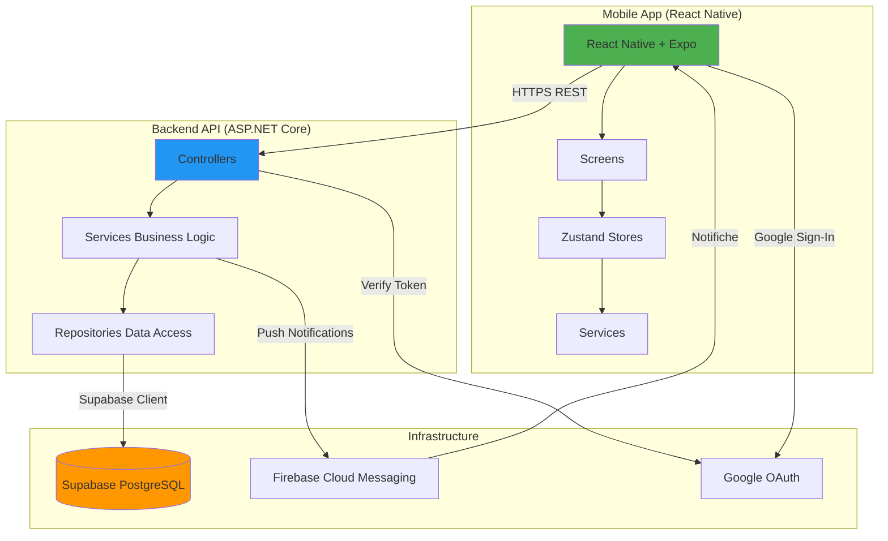
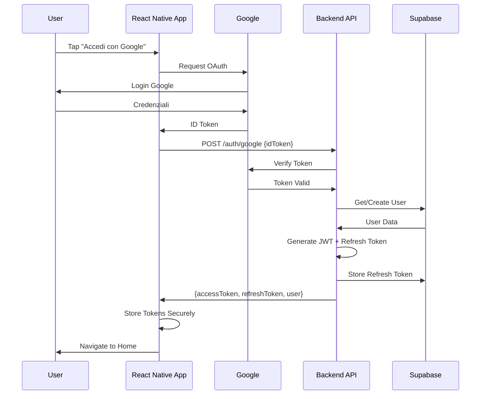
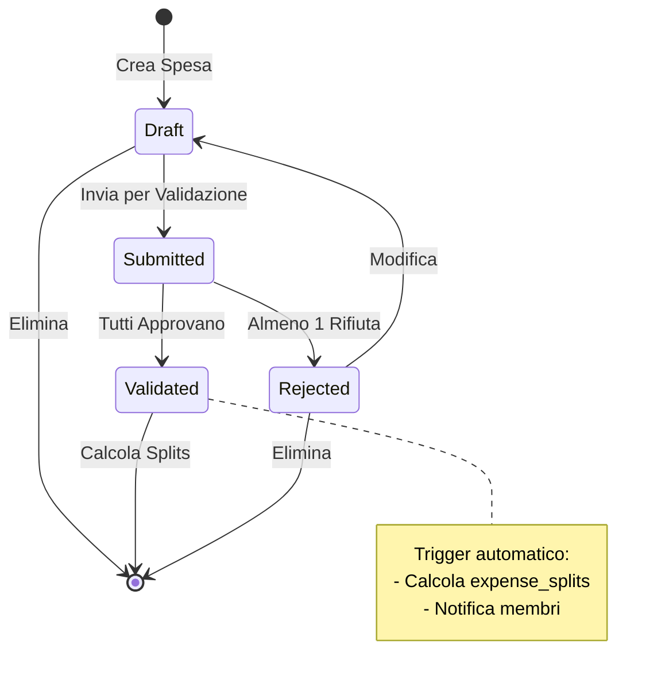
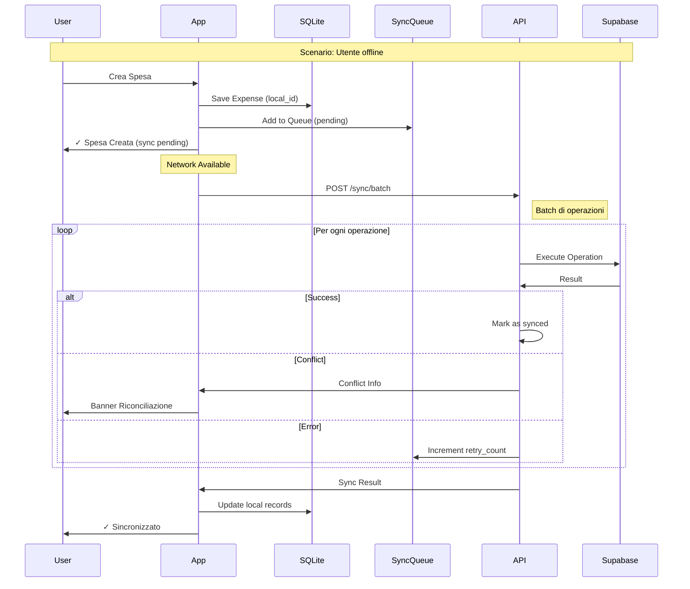
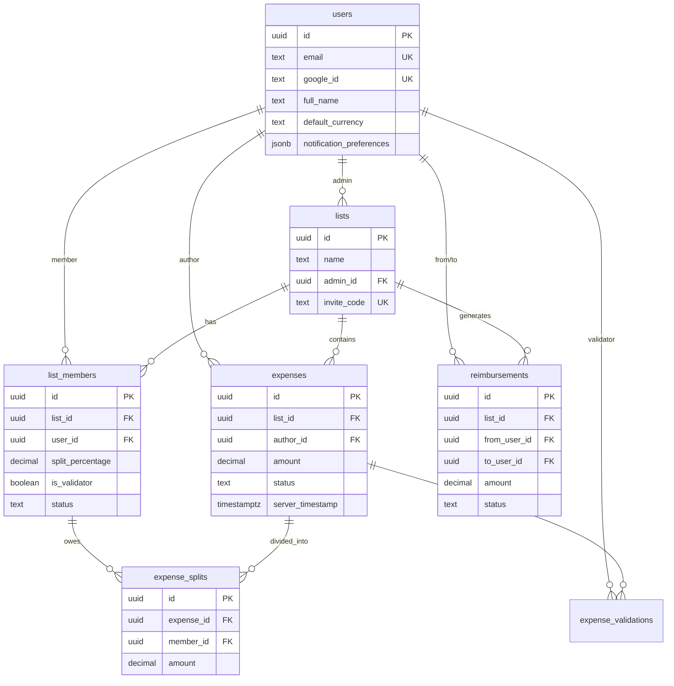
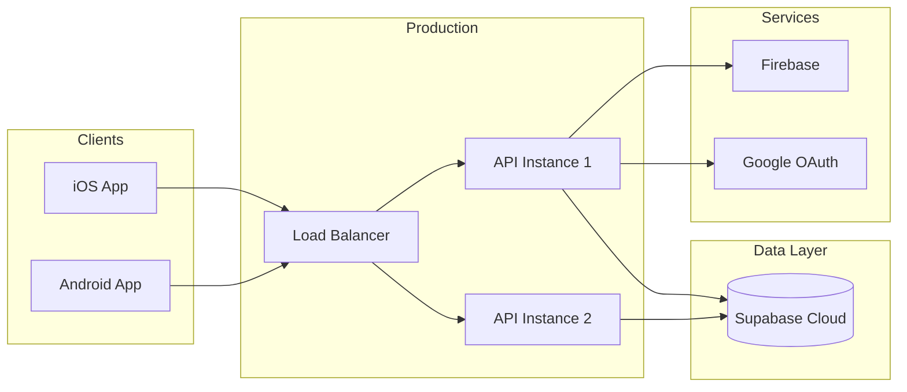

# Architettura Sistema Split Expenses

## Diagramma Architetturale



## Flusso Autenticazione



## Workflow Spesa



## Calcolo Rimborsi Ottimizzati

```mermaid
flowchart TD
    Start([Inizio]) --> GetExpenses[Recupera Spese Validate]
    GetExpenses --> CalcBalance[Calcola Bilancio per Membro]
    CalcBalance --> SortDebtors[Ordina Debitori Crescente]
    SortDebtors --> SortCreditors[Ordina Creditori Decrescente]
    SortCreditors --> HasDebtors{Ci sono debitori?}

    HasDebtors -->|Sì| HasCreditors{Ci sono creditori?}
    HasDebtors -->|No| End([Fine])

    HasCreditors -->|Sì| CalcTransfer[transfer = min(debito, credito)]
    HasCreditors -->|No| End

    CalcTransfer --> CreateReimbursement[Crea Rimborso]
    CreateReimbursement --> UpdateBalances[Aggiorna Bilanci]
    UpdateBalances --> CheckDebtor{Debito Saldato?}

    CheckDebtor -->|Sì| NextDebtor[Prossimo Debitore]
    CheckDebtor -->|No| UpdateDebtor[Aggiorna Debito]

    NextDebtor --> CheckCreditor
    UpdateDebtor --> CheckCreditor{Credito Saldato?}

    CheckCreditor -->|Sì| NextCreditor[Prossimo Creditore]
    CheckCreditor -->|No| UpdateCreditor[Aggiorna Credito]

    NextCreditor --> HasDebtors
    UpdateCreditor --> HasDebtors
```

## Sincronizzazione Offline



## Struttura Database



## Stack Tecnologico

### Backend
```
ASP.NET Core 8.0
├── Controllers (REST API)
├── Services (Business Logic)
│   ├── AuthService
│   ├── NotificationService
│   └── SyncService
├── Repositories (Data Access)
│   ├── UserRepository
│   ├── ListRepository
│   ├── ExpenseRepository
│   └── ReimbursementRepository
└── Models (Domain)
```

### Mobile
```
React Native + Expo + TypeScript
├── screens/ (UI Components)
├── store/ (Zustand State)
├── services/
│   ├── api.service (Axios HTTP)
│   ├── auth.service
│   ├── supabase.client (Direct DB)
│   └── storage.service
├── components/ (Reusable UI)
└── types/ (TypeScript)
```

### Database
```
Supabase (PostgreSQL)
├── Tables (11)
├── RLS Policies (Security)
├── Stored Procedures
│   ├── calculate_expense_splits
│   ├── calculate_optimized_reimbursements
│   └── generate_reimbursements_for_list
└── Triggers
    └── update_expense_status_after_validation
```

## Pattern e Principi

### Backend Architecture
- **Layered Architecture**: Controllers → Services → Repositories
- **Dependency Injection**: Tutti i servizi registrati in Program.cs
- **Repository Pattern**: Astrazione accesso dati
- **Single Responsibility**: Ogni classe ha un solo scopo

### Mobile Architecture
- **Component-Based**: React functional components
- **State Management**: Zustand stores
- **Hooks Pattern**: React hooks for logic
- **Service Layer**: Direct Supabase + HTTP API

### Security
- **Authentication**: Google OAuth + JWT
- **Authorization**: Claims-based con policy
- **Data Security**: RLS su database
- **Token Security**: Refresh token con rotazione

## Deployment Architecture



## Scalabilità

### Horizontal Scaling
- API stateless: può essere replicata
- Load balancer distribuisce carico
- Supabase gestisce connection pooling

### Vertical Scaling
- Aumenta risorse Docker container
- Ottimizza query database con indici
- Caching strategico (Redis future)

### Performance Optimization
- Indici database su campi chiave
- Batch operations per sync
- Pagination per liste grandi
- Lazy loading su mobile

## Monitoring e Observability

### Logs
- Application Insights (Azure)
- Serilog structured logging
- Docker logs persistenti

### Metrics
- Request rate/latency
- Error rate
- Database query performance
- Sync success rate

### Alerts
- API down
- High error rate
- Database connection issues
- Sync failures

---

**Ultimo aggiornamento**: 2025-10-10
