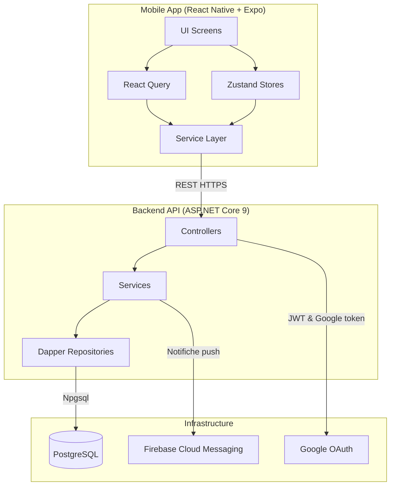
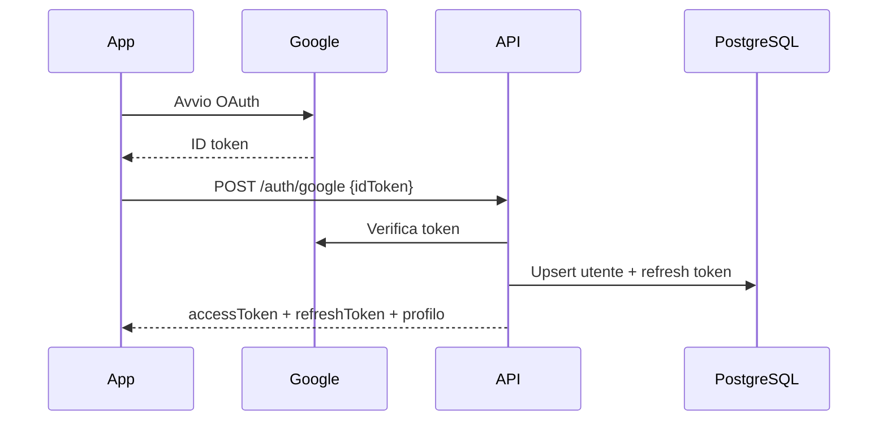
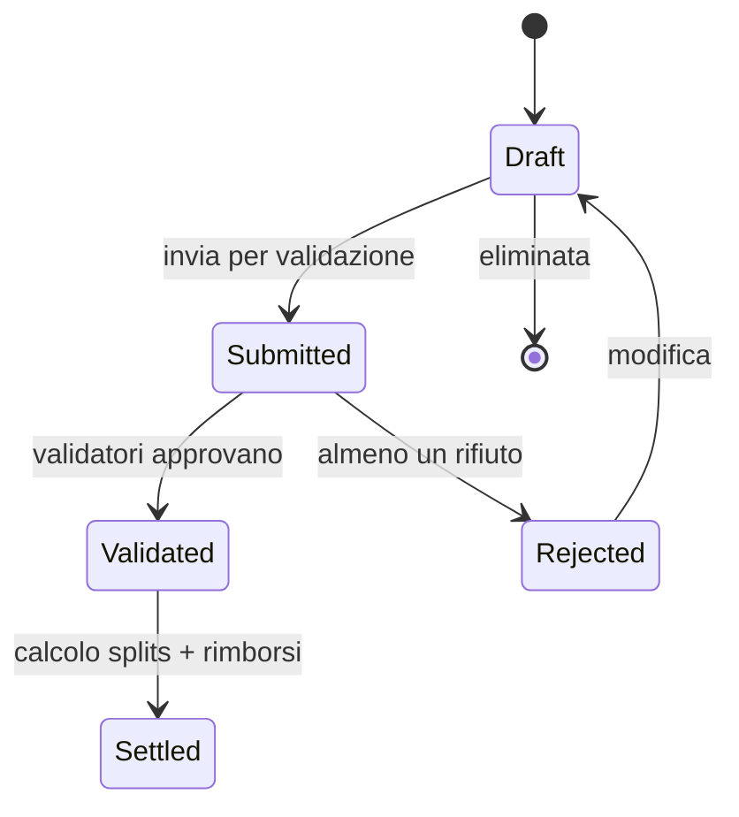

# Architettura Split Expenses

Panoramica di backend ASP.NET Core, app mobile React Native e infrastruttura PostgreSQL/Traefik.

## Diagramma alto livello



## Flussi chiave

### Autenticazione Google → JWT



> Nota: il backend espone il flusso OAuth, ma l'attuale versione della app non include una schermata di login Google.

### Ciclo di vita di una spesa



## Schema dati

```mermaid
erDiagram
    users ||--o{ lists : admin
    users ||--o{ list_members : membro
    users ||--o{ expenses : autore
    users ||--o{ reimbursements : from/to
    users ||--o{ expense_validations : validatore

    lists ||--o{ list_members : has
    lists ||--o{ expenses : contains
    lists ||--o{ reimbursements : genera

    list_members ||--o{ expense_splits : owes
    expenses ||--o{ expense_splits : divided
    expenses ||--o{ expense_validations : reviewed

    users {
        uuid id PK
        text email UK
        text google_id UK
        text full_name
        text default_currency
        jsonb notification_preferences
    }

    lists {
        uuid id PK
        text name
        uuid admin_id FK
        text invite_code UK
    }

    list_members {
        uuid id PK
        uuid list_id FK
        uuid user_id FK
        text email
        text display_name
        decimal split_percentage
        boolean is_validator
        text status
        timestamptz joined_at
    }

    expenses {
        uuid id PK
        uuid list_id FK
        uuid author_id FK
        decimal amount
        text status
        timestamptz expense_date
        text payment_method
    }

    expense_splits {
        uuid id PK
        uuid expense_id FK
        uuid member_id FK
        decimal amount
    }

    reimbursements {
        uuid id PK
        uuid list_id FK
        uuid from_user_id FK
        uuid to_user_id FK
        decimal amount
        text status
    }
```

## Componenti backend

- **Controllers:** Auth, Lists, Expenses, Reimbursements, Notifications (Swagger attivo su `/swagger`).
- **Services:** generazione JWT/refresh, validazione Google, calcolo rimborsi, invio notifiche FCM, normalizzazione nomi membri.
- **Repositories:** Dapper + Npgsql per query SQL, aderenti alle migration in `backend/migrations` (include stored procedure per rimborsi).
- **Configurazione:** `appsettings.json` per connection string, chiavi JWT e Google; `docker-compose*.yml` per PostgreSQL locale/NAS.

## Componenti mobile

- **UI & navigazione:** React Navigation (stack + tab), theming chiaro/scuro con design tokens in `src/theme`.
- **State & dati:** Zustand per lo stato utente/impostazioni, React Query per cache API, AsyncStorage/SecureStore per token, SQLite per cache offline spese/liste.
- **Services:** `api.service.ts` centralizza Axios, servizi dedicati per liste, spese, rimborsi e auth (deep-link inviti; il login Google non è esposto in UI).
- **Feature:** grafici Victory in tab Insights, upload scontrini con Expo Image Picker/File System, notifiche push via `expo-notifications`.

## Sincronizzazione e resilienza

- Cache locale (SQLite/AsyncStorage) per liste/spese con retry automatico lato client quando la rete torna disponibile.
- Refresh token e rotazione gestiti dall'API; errori di connessione mostrati con messaggi localizzati.
- Validazioni server-side sui permessi di lista, percentuali di split e ruoli admin/validatori.

## Deployment & osservabilità

- **Locale:** docker-compose per PostgreSQL (`docker-compose.db.yml`) + `dotnet run` per API.
- **NAS/Produzione:** `docker-compose-nas.yml` con Traefik (porte 8080/10443) e certificati Let's Encrypt, vedi [TRAEFIK_SUMMARY.md](TRAEFIK_SUMMARY.md).
- **Monitoring:** logging strutturato (ASP.NET + Serilog-ready) e health check su `/health`.

---
**Ultimo aggiornamento:** 2025-01-15
